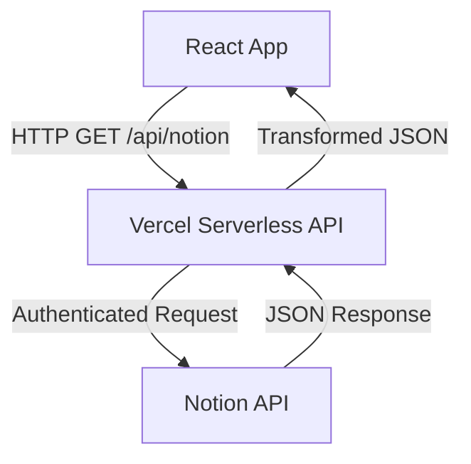

# Notion Integration Documentation

This document consolidates all information regarding the migration from Google Sheets to Notion as the primary data source for the personal portfolio website.

## Table of Contents

1. [Migration Plan](#migration-plan)
2. [Requirements](#requirements)
3. [Design Specification](#design-specification)
4. [Integration Mapping](#integration-mapping)
5. [Task List](#task-list)

---

## Migration Plan

Notion provides a robust API that can serve as a headless CMS/database, offering better content management capabilities, richer data types, and a more intuitive interface for content updates.

### Strategy Overview

1. **Phase 1: Notion Workspace Setup**: Create integration and databases.
2. **Phase 2: Backend API Setup**: Implement serverless functions on Vercel to proxy Notion requests securely.
3. **Phase 3: Frontend Implementation**: Create hooks and services to fetch and transform Notion data.
4. **Phase 4: Testing & Validation**: Ensure data integrity and performance.

---

## Requirements

### Business Objectives

- Replace Google Sheets dependency with Notion.
- Maintain existing functionality and user experience.
- Enable non-technical content updates via Notion UI.
- Improve data structure and security.

### Key Functional Requirements

- **FR-001**: Setup About, Projects, and Work databases in Notion.
- **FR-003**: Implement server-side API proxy to keep API keys secure.
- **FR-007**: Transform Notion API responses to match current data structures.
- **FR-009**: Remove Google Sheets dependency after successful migration.

---

## Design Specification

### System Architecture

### Data Flow

1. Notion Database queries via API.
2. Serverless Function transforms and caches data.
3. React Components render processed data.

### Database Schemas

#### About Database

- `Category` (Title)
- `Description` (Rich Text)

#### Projects Database

- `Title` (Title)
- `Slug` (Text)
- `Date` (Date)
- `Keyword` (Select/Multi-select)
- `Link` (URL)
- `Content` (Rich Text)
- `Image` (Files & Media)

#### Work Database

- `Title` (Title)
- `Company` (Text)
- `Place` (Text)
- `From` (Date)
- `To` (Date)
- `Description` (Rich Text)
- `Slug` (Text)

---

## Integration Mapping

### Database Schemas & IDs

| Database | ID | Notion URL |
|----------|----|------------|
| Projects | `29dda682bcf6806eaa2efe20631dab6c` | [Link](https://www.notion.so/29dda682bcf6806eaa2efe20631dab6c) |
| Work | `b589d1ef5ef64b35abcc88558bf5574f` | [Link](https://www.notion.so/b589d1ef5ef64b35abcc88558bf5574f) |
| About | `aab0a96e279d48b6833f6727e6301266` | [Link](https://www.notion.so/aab0a96e279d48b6833f6727e6301266) |

### Schema Mapping (Example: Projects)

| Notion Field | Type | Google Sheets Equivalent |
|--------------|------|-------------------------|
| title | title | title |
| slug | text | slug |
| date | number | date |
| Keyword | multi_select | keyword |
| link | url | link |
| content | text | content |
| image | text | image |

---

## Task List

### Phase 1: Notion Workspace Setup

- [x] Create Notion Integration
- [x] Create About, Projects, and Work Databases
- [x] Share Databases with Integration
- [x] Migrate Data from Google Sheets

### Phase 2: Backend API Setup

- [x] Create API Directory Structure
- [x] Install Notion SDK
- [x] Implement Notion Client Wrapper
- [x] Create Data Transformation Functions
- [x] Implement About, Projects, and Work Endpoints
- [x] Configure Environment Variables

### Phase 3: Frontend Implementation

- [x] Update Configuration Constants
- [x] Create Notion Context Provider
- [x] Update Components (About, Projects, Work) to use Notion data
- [x] Remove Google Sheets Provider and dependencies

---
*Note: This document is a consolidated version of several original planning documents.*
